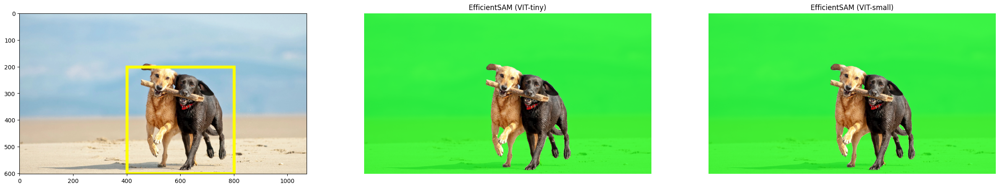
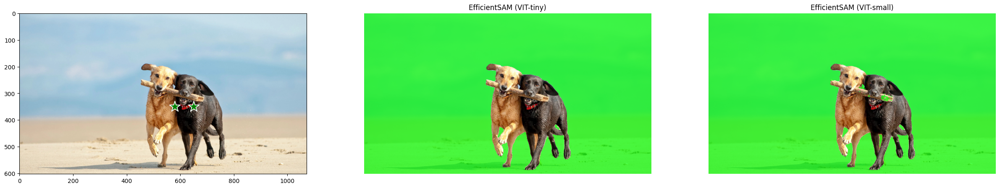
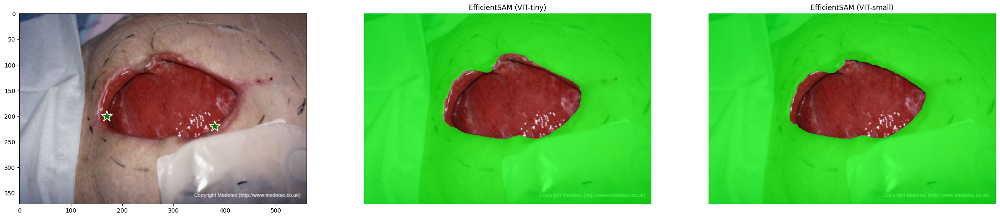

# Efficient SAM Example

This script provides example for how to get visualization result from EfficientSAM using weight file, part of the code is borrow from MobileSAM project, many thanks!

## Setup


```python
import matplotlib.pyplot as plt
import numpy as np
import torch
from torchvision.transforms import ToTensor
from PIL import Image
import io
```

# Box and Point prompt


```python
def run_ours_box_or_points(img_path, pts_sampled, pts_labels, model):
    image_np = np.array(Image.open(img_path))
    img_tensor = ToTensor()(image_np)
    pts_sampled = torch.reshape(torch.tensor(pts_sampled), [1, 1, -1, 2])
    pts_labels = torch.reshape(torch.tensor(pts_labels), [1, 1, -1])
    predicted_logits, predicted_iou = model(
        img_tensor[None, ...],
        pts_sampled,
        pts_labels,
    )

    sorted_ids = torch.argsort(predicted_iou, dim=-1, descending=True)
    predicted_iou = torch.take_along_dim(predicted_iou, sorted_ids, dim=2)
    predicted_logits = torch.take_along_dim(
        predicted_logits, sorted_ids[..., None, None], dim=2
    )

    return torch.ge(predicted_logits[0, 0, 0, :, :], 0).cpu().detach().numpy()
```

# Visualization Related


```python
def show_mask(mask, ax, random_color=False):
    if random_color:
        color = np.concatenate([np.random.random(3), np.array([0.6])], axis=0)
    else:
        color = np.array([30 / 255, 144 / 255, 255 / 255, 0.8])
    h, w = mask.shape[-2:]
    mask_image = mask.reshape(h, w, 1) * color.reshape(1, 1, -1)
    ax.imshow(mask_image)


def show_points(coords, labels, ax, marker_size=375):
    pos_points = coords[labels == 1]
    neg_points = coords[labels == 0]
    ax.scatter(
        pos_points[:, 0],
        pos_points[:, 1],
        color="green",
        marker="*",
        s=marker_size,
        edgecolor="white",
        linewidth=1.25,
    )
    ax.scatter(
        neg_points[:, 0],
        neg_points[:, 1],
        color="red",
        marker="*",
        s=marker_size,
        edgecolor="white",
        linewidth=1.25,
    )


def show_box(box, ax):
    x0, y0 = box[0], box[1]
    w, h = box[2] - box[0], box[3] - box[1]
    ax.add_patch(
        plt.Rectangle((x0, y0), w, h, edgecolor="yellow", facecolor=(0, 0, 0, 0), lw=5)
    )

def show_anns_ours(mask, ax):
    ax.set_autoscale_on(False)
    img = np.ones((mask.shape[0], mask.shape[1], 4))
    img[:, :, 3] = 0
    color_mask = [0, 1, 0, 0.7]
    img[np.logical_not(mask)] = color_mask
    ax.imshow(img)

```

# Create the model and load the weights from the checkpoint.


```python
!git clone https://github.com/yformer/EfficientSAM.git
import os
os.chdir("EfficientSAM")
```

    Cloning into 'EfficientSAM'...
    Updating files:  92% (35/38)
    Updating files:  94% (36/38)
    Updating files:  97% (37/38)
    Updating files: 100% (38/38)
    Updating files: 100% (38/38), done.
    


```python
from efficient_sam.build_efficient_sam import build_efficient_sam_vitt, build_efficient_sam_vits
# from squeeze_sam.build_squeeze_sam import build_squeeze_sam
import zipfile

efficient_sam_vitt_model = build_efficient_sam_vitt()
efficient_sam_vitt_model.eval()

# Since EfficientSAM-S checkpoint file is >100MB, we store the zip file.
with zipfile.ZipFile("weights/efficient_sam_vits.pt.zip", 'r') as zip_ref:
    zip_ref.extractall("weights")
efficient_sam_vits_model = build_efficient_sam_vits()
efficient_sam_vits_model.eval()

# squeeze_sam_model = build_squeeze_sam()
# squeeze_sam_model.eval()

```


    EfficientSam(
      (image_encoder): ImageEncoderViT(
        (patch_embed): PatchEmbed(
          (proj): Conv2d(3, 384, kernel_size=(16, 16), stride=(16, 16))
        )
        (blocks): ModuleList(
          (0-11): 12 x Block(
            (norm1): LayerNorm((384,), eps=1e-06, elementwise_affine=True)
            (attn): Attention(
              (qkv): Linear(in_features=384, out_features=1152, bias=True)
              (proj): Linear(in_features=384, out_features=384, bias=True)
            )
            (norm2): LayerNorm((384,), eps=1e-06, elementwise_affine=True)
            (mlp): Mlp(
              (fc1): Linear(in_features=384, out_features=1536, bias=True)
              (act): GELU(approximate='none')
              (fc2): Linear(in_features=1536, out_features=384, bias=True)
            )
          )
        )
        (neck): Sequential(
          (0): Conv2d(384, 256, kernel_size=(1, 1), stride=(1, 1), bias=False)
          (1): LayerNorm2d()
          (2): Conv2d(256, 256, kernel_size=(3, 3), stride=(1, 1), padding=(1, 1), bias=False)
          (3): LayerNorm2d()
        )
      )
      (prompt_encoder): PromptEncoder(
        (pe_layer): PositionEmbeddingRandom()
        (invalid_points): Embedding(1, 256)
        (point_embeddings): Embedding(1, 256)
        (bbox_top_left_embeddings): Embedding(1, 256)
        (bbox_bottom_right_embeddings): Embedding(1, 256)
      )
      (mask_decoder): MaskDecoder(
        (transformer): TwoWayTransformer(
          (layers): ModuleList(
            (0-1): 2 x TwoWayAttentionBlock(
              (self_attn): AttentionForTwoWayAttentionBlock(
                (q_proj): Linear(in_features=256, out_features=256, bias=True)
                (k_proj): Linear(in_features=256, out_features=256, bias=True)
                (v_proj): Linear(in_features=256, out_features=256, bias=True)
                (out_proj): Linear(in_features=256, out_features=256, bias=True)
              )
              (norm1): LayerNorm((256,), eps=1e-05, elementwise_affine=True)
              (cross_attn_token_to_image): AttentionForTwoWayAttentionBlock(
                (q_proj): Linear(in_features=256, out_features=128, bias=True)
                (k_proj): Linear(in_features=256, out_features=128, bias=True)
                (v_proj): Linear(in_features=256, out_features=128, bias=True)
                (out_proj): Linear(in_features=128, out_features=256, bias=True)
              )
              (norm2): LayerNorm((256,), eps=1e-05, elementwise_affine=True)
              (mlp): MLPBlock(
                (layers): ModuleList(
                  (0): Sequential(
                    (0): Linear(in_features=256, out_features=2048, bias=True)
                    (1): GELU(approximate='none')
                  )
                )
                (fc): Linear(in_features=2048, out_features=256, bias=True)
              )
              (norm3): LayerNorm((256,), eps=1e-05, elementwise_affine=True)
              (norm4): LayerNorm((256,), eps=1e-05, elementwise_affine=True)
              (cross_attn_image_to_token): AttentionForTwoWayAttentionBlock(
                (q_proj): Linear(in_features=256, out_features=128, bias=True)
                (k_proj): Linear(in_features=256, out_features=128, bias=True)
                (v_proj): Linear(in_features=256, out_features=128, bias=True)
                (out_proj): Linear(in_features=128, out_features=256, bias=True)
              )
            )
          )
          (final_attn_token_to_image): AttentionForTwoWayAttentionBlock(
            (q_proj): Linear(in_features=256, out_features=128, bias=True)
            (k_proj): Linear(in_features=256, out_features=128, bias=True)
            (v_proj): Linear(in_features=256, out_features=128, bias=True)
            (out_proj): Linear(in_features=128, out_features=256, bias=True)
          )
          (norm_final_attn): LayerNorm((256,), eps=1e-05, elementwise_affine=True)
        )
        (iou_token): Embedding(1, 256)
        (mask_tokens): Embedding(4, 256)
        (final_output_upscaling_layers): ModuleList(
          (0): Sequential(
            (0): ConvTranspose2d(256, 64, kernel_size=(2, 2), stride=(2, 2))
            (1): GroupNorm(1, 64, eps=1e-05, affine=True)
            (2): GELU(approximate='none')
          )
          (1): Sequential(
            (0): ConvTranspose2d(64, 32, kernel_size=(2, 2), stride=(2, 2))
            (1): Identity()
            (2): GELU(approximate='none')
          )
        )
        (output_hypernetworks_mlps): ModuleList(
          (0-3): 4 x MLPBlock(
            (layers): ModuleList(
              (0-1): 2 x Sequential(
                (0): Linear(in_features=256, out_features=256, bias=True)
                (1): GELU(approximate='none')
              )
            )
            (fc): Linear(in_features=256, out_features=32, bias=True)
          )
        )
        (iou_prediction_head): MLPBlock(
          (layers): ModuleList(
            (0-1): 2 x Sequential(
              (0): Linear(in_features=256, out_features=256, bias=True)
              (1): GELU(approximate='none')
            )
          )
          (fc): Linear(in_features=256, out_features=4, bias=True)
        )
      )
    )


1. **影像編碼器（Image Encoder - ImageEncoderViT）**:
   - **補丁嵌入（Patch Embed）**:
     - `proj`: 這是一個二維卷積層，將輸入的三通道影像轉換為 384 通道的特徵圖，核大小為 16x16，步長為 16x16。這個步驟將影像分割為多個補丁並將其嵌入到高維空間。
   - **塊組成的序列（Blocks - ModuleList）**:
     - 由 12 個相同的 `Block` 組成，每個 `Block` 包括以下組件：
       - `norm1`: 第一個層標準化（LayerNorm），正規化 384 維的特徵向量。
       - `attn`: 注意力機制模塊，包括一個線性層用於生成查詢、鍵和值，另一個線性層用於輸出投影。
       - `norm2`: 第二個層標準化。
       - `mlp`: 一個多層感知機，包含兩個線性層和 GELU 激活函數，用於特徵轉換。

2. **頸部結構（Neck - Sequential）**:
   - 這部分包括數個卷積層和層標準化，進一步處理和調整特徵圖。

3. **提示編碼器（Prompt Encoder）**:
   - `pe_layer`: 隨機位置嵌入層，用於生成提示的位置嵌入。
   - `invalid_points`、`point_embeddings`、`bbox_top_left_embeddings`、`bbox_bottom_right_embeddings`: 不同類型的嵌入層，用於編碼不同類型的提示信息。

4. **掩碼解碼器（Mask Decoder）**:
   - **雙向轉換器（TwoWayTransformer）**:
     - 包含一系列的 `TwoWayAttentionBlock`，每個包含自注意力機制和交叉注意力機制，以及多層感知機，用於處理和融合來自不同來源的特徵。
   - **最終輸出上

採樣層（Final Output Upscaling Layers）**:
     - 由卷積反向傳播層組成，用於將特徵圖逐步放大回更接近原始影像的解析度。包括兩個 `Sequential` 模塊，每個都包含一個轉置卷積層（用於上採樣），一個群組標準化層，和 GELU 激活函數。

5. **輸出超網絡（Output Hypernetworks MLPs）**:
   - 這部分包括多個多層感知機（MLPBlock），用於從特徵中提取最終的輸出信息，如對分割掩碼的不同部分的預測。

6. **IoU 預測頭（IoU Prediction Head）**:
   - 一個專門用於預測交集過聯合比（IoU）的多層感知機模塊，包括兩個 `Sequential` 模塊和一個線性輸出層。

綜合來看，`EfficientSam` 模型通過其影像編碼器提取高維特徵，透過提示編碼器處理提示信息，然後在掩碼解碼器中結合這些信息並進行上採樣和融合，最終通過輸出超網絡和 IoU 預測頭生成分割掩碼並評估其質量。這個模型充分利用了深度學習和注意力機制的優勢，適用於複雜的圖像分割任務。

IoU（交集過聯合比，Intersection over Union）是一種常用於評估圖像分割和物體檢測任務的性能指標。IoU 計算的是預測分割區域（或邊界框）和真實分割區域（或邊界框）之間的重疊程度。在圖像分割中，它衡量預測掩碼和真實掩碼之間的相似性。

### IoU 的計算方法

假設我們有預測分割掩碼（或邊界框）A和真實分割掩碼（或邊界框）B，IoU 計算公式如下：

$$ IoU = \frac{區域(A \cap B)}{區域(A \cup B)} $$

其中：
-  $A \cap B$ 表示 A 和 B 的交集，即兩者重疊的部分。
-  $A \cup B$ 表示 A 和 B 的聯集，即兩者總共覆蓋的區域。

### IoU 的值範圍

- IoU 的值範圍從 0 到 1。
- IoU = 1 表示完美重疊，預測和真實完全一致。
- IoU = 0 表示沒有重疊，預測和真實完全不相交。

### IoU 的應用

- **物體檢測**：在物體檢測任務中，IoU 用於評估預測邊界框和真實邊界框的準確性。
- **圖像分割**：在圖像分割中，特別是醫學影像分割，IoU 用於衡量預測的分割區域與真實分割區域的一致性。
- **模型評估和比較**：IoU 是比較不同模型性能的常用指標，特別是在分割和檢測任務中。

### IoU 的重要性

- IoU 提供了一個直觀且易於理解的方式來衡量預測的準確性。
- 它幫

助分析模型在定位物體或分割區域方面的效能，特別是在重疊區域的準確性方面。
- 與單純的像素精度相比，IoU 能更好地處理大小不一致的物體或分割區域，因為它考慮了預測和實際之間的重疊比例。
- 在某些應用中，例如自動駕駛車輛和醫學影像診斷，IoU 的高準確性至關重要。

### IoU 的局限性

- IoU 可能對小物體或小區域的預測不夠敏感，因為小區域的預測誤差在整體聯集區域中所占的比例較小。
- 如果模型對某些類別的預測極其不準確，但對其他類別準確性很高，單一的 IoU 值可能無法完全反映模型在所有類別上的總體表現。

總的來說，IoU 是一種平衡且全面的指標，廣泛用於評估物體檢測和圖像分割模型的性能。然而，它也應與其他指標（如精度、召回率等）結合使用，以獲得對模型性能的更全面理解。

## Box segmentation

prepare your own image here


```python
x1=400
y1=200
x2=800
y2=600
w=x2-x1
h=y2-y1

fig, ax = plt.subplots(1, 3, figsize=(30, 30))
input_point = np.array([[x1, y1], [x2, y2]])
input_label = np.array([2,3])
image_path = "figs/examples/dogs.jpg"
image = np.array(Image.open(image_path))
show_points(input_point, input_label, ax[0])
show_box([x1,y1,x2,y2], ax[0])
ax[0].imshow(image)


ax[1].imshow(image)
mask_efficient_sam_vitt = run_ours_box_or_points(image_path, input_point, input_label, efficient_sam_vitt_model)
show_anns_ours(mask_efficient_sam_vitt, ax[1])
ax[1].title.set_text("EfficientSAM (VIT-tiny)")
ax[1].axis('off')

ax[2].imshow(image)
mask_efficient_sam_vits = run_ours_box_or_points(image_path, input_point, input_label, efficient_sam_vits_model)
show_anns_ours(mask_efficient_sam_vits, ax[2])
ax[2].title.set_text("EfficientSAM (VIT-small)")
ax[2].axis('off')


# ax[3].imshow(image)
# mask_squeeze_sam = run_ours_box_or_points(image_path, input_point, input_label, squeeze_sam_model)
# show_anns_ours(mask_squeeze_sam, ax[3])
# ax[3].title.set_text("SqueezeSAM")
# ax[3].axis('off')

plt.show()
```


    

    


## Point segmentation


```python
fig, ax = plt.subplots(1, 3, figsize=(30, 30))

input_label = np.array([1, 1])
image_path = "figs/examples/dogs.jpg"
input_point = np.array([[580, 350], [650, 350]])
image = np.array(Image.open(image_path))
show_points(input_point, input_label, ax[0])
ax[0].imshow(image)


ax[1].imshow(image)
mask_efficient_sam_vitt = run_ours_box_or_points(image_path, input_point, input_label, efficient_sam_vitt_model)
show_anns_ours(mask_efficient_sam_vitt, ax[1])
ax[1].title.set_text("EfficientSAM (VIT-tiny)")
ax[1].axis('off')

ax[2].imshow(image)
mask_efficient_sam_vits = run_ours_box_or_points(image_path, input_point, input_label, efficient_sam_vits_model)
show_anns_ours(mask_efficient_sam_vits, ax[2])
ax[2].title.set_text("EfficientSAM (VIT-small)")
ax[2].axis('off')


# ax[3].imshow(image)
# mask_squeeze_sam = run_ours_box_or_points(image_path, input_point, input_label, squeeze_sam_model)
# show_anns_ours(mask_squeeze_sam, ax[3])
# ax[3].title.set_text("SqueezeSAM")
# ax[3].axis('off')

plt.show()
```


    

    


```python
fig, ax = plt.subplots(1, 3, figsize=(30, 30))

input_label = np.array([1, 1])
image_path = your path
input_point = np.array([[170, 200], [380, 220]])
image = np.array(Image.open(image_path))
show_points(input_point, input_label, ax[0])
ax[0].imshow(image)


ax[1].imshow(image)
mask_efficient_sam_vitt = run_ours_box_or_points(image_path, input_point, input_label, efficient_sam_vitt_model)
show_anns_ours(mask_efficient_sam_vitt, ax[1])
ax[1].title.set_text("EfficientSAM (VIT-tiny)")
ax[1].axis('off')

ax[2].imshow(image)
mask_efficient_sam_vits = run_ours_box_or_points(image_path, input_point, input_label, efficient_sam_vits_model)
show_anns_ours(mask_efficient_sam_vits, ax[2])
ax[2].title.set_text("EfficientSAM (VIT-small)")
ax[2].axis('off')


# ax[3].imshow(image)
# mask_squeeze_sam = run_ours_box_or_points(image_path, input_point, input_label, squeeze_sam_model)
# show_anns_ours(mask_squeeze_sam, ax[3])
# ax[3].title.set_text("SqueezeSAM")
# ax[3].axis('off')

plt.show()
```


    

    


```python

```


@article{xiong2023efficientsam,
  title={EfficientSAM: Leveraged Masked Image Pretraining for Efficient Segment Anything},
  author={Yunyang Xiong, Bala Varadarajan, Lemeng Wu, Xiaoyu Xiang, Fanyi Xiao, Chenchen Zhu, Xiaoliang Dai, Dilin Wang, Fei Sun, Forrest Iandola, Raghuraman Krishnamoorthi, Vikas Chandra},
  journal={arXiv:2312.00863},
  year={2023}
}
